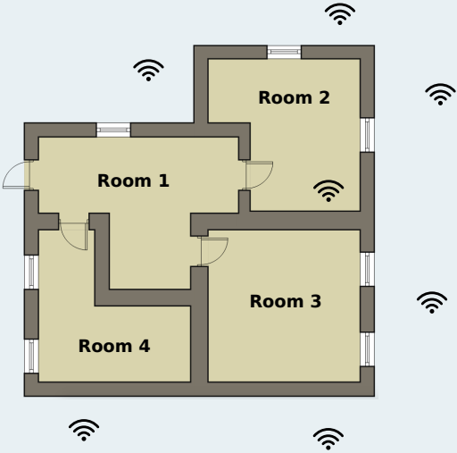
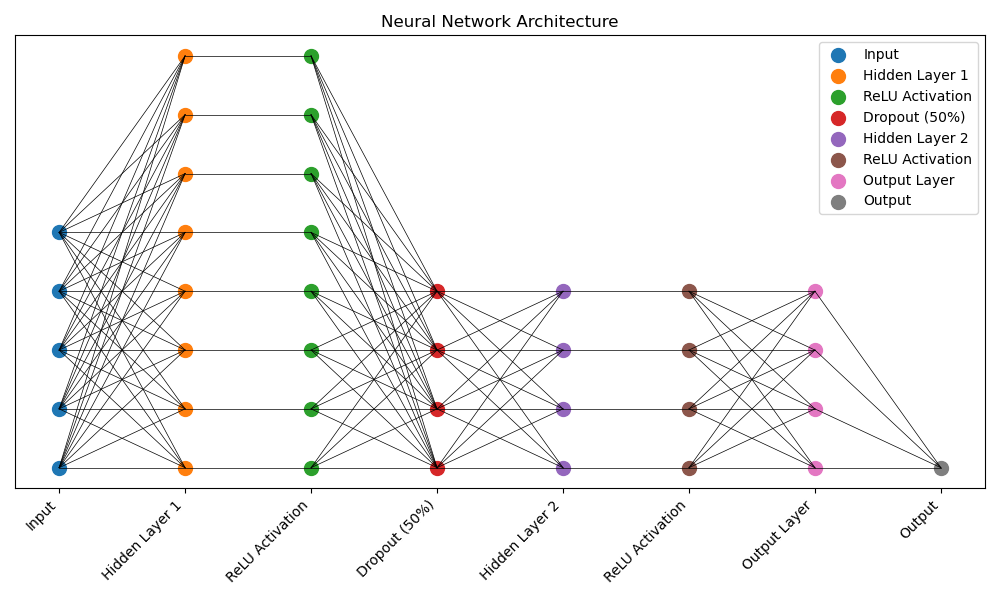

# ML-Coursework

This repo contains my coursework assignments for my Year 3 ML module at Imperial College London. For this coursework I learnt the following:

* K-NN Classifiers
* Decision Trees
* Evaluation of ML models (Confusion matrix, performance metrics, etc)
* Hyperparameter tuning (dataset split + crossvalidation)
* Principles of overfitting and mitigation
* NNs
    * Linear regression
    * Activation functions
    * Backpropagation
    * Gradient Descent
    * Overfitting

## CW1 - Decision Trees

Implemented a decision tree algorithm and use it to determine one of the indoor
locations based on WIFI signal strengths collected from a mobile phone.

## CW2 - Neural Networks

### Part 1 - NN mini-library

Implemented a low-level implementation of a multi-layered neural network, including a basic implementation of the backpropagation algorithm. This involved implementing necessary functions for data preprocessing, training and evaluation.

### Part 2 - NN for regression

Developed and optimised a neural network architecture to predict the price of houses in California using the California House Prices Dataset. 

Libraries used:

* PyTorch
* Numpy
* Pandas
* Scikit-learn

